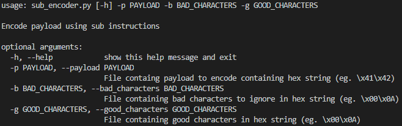
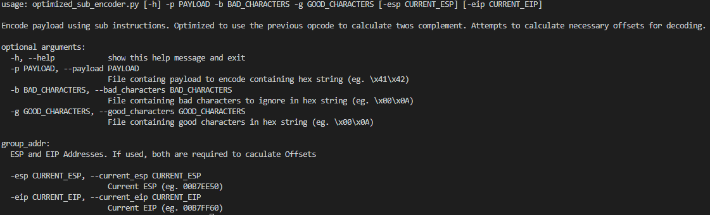
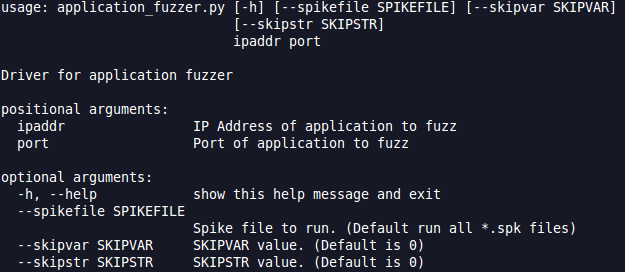
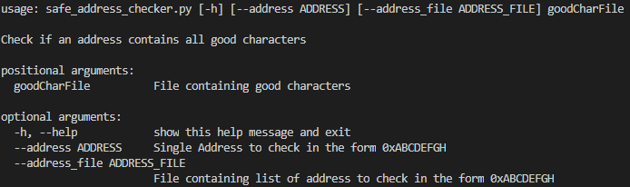

# Custom Tools

## chunk_file
Python script that splits a file in half.  This is to help identify the section of the file that is triggering antivirus.  

Usage: `chunk_file.py <name of file to split> <output filename>`

## compile_assembly
Modified shell script from the PentesterAcademy's [x86 Assembly Language and Shellcoding on Linux](https://www.pentesteracademy.com/course?id=3) course.  The script was modified to 
 - Extract the shellcode and write to a file
 - Disable the executable and write to a file
 - Check for null bytes

 Usage: `./compile.sh template`

## encoder
Alphanumeric Sub-Encoder developed from Metasploit's opt_sub.rb encoder and Corelan's Mona encoder.

`sub_encoder.py` attempts to encode a payload using SUB instructions.  This version does not attempt to optimize the command set and does not calculate the decode location.




`optimized_sub_encoder.py` attempts to optimize the SUB instructions.  This version will attempt to calculate the decode location. 



## fuzzing
Python script to automate fuzzing multiple inputs of an application using Spike.  If a crash is detected, the script will wait for the user to restart the application before continuing.    

spike.c was modified to exit when the application becomes unresponsive.  We assume that when the application is unresponsive, the current command caused a crashed.  

Run the script in the same directory as all of your *.spk files.



## safe_address_checker
Python script to check one or more addresses against a set of good characters.  This is useful when trying to find an address in an application with a restricted character set.  



## str_to_hex
Python script that will convert a string to 4 byte PUSH instructions.  For example, if you had a file that contained the string 'Hello World' the output would be
```
; 'Hello World '
push 0x00000000
push 0x20646c72
push 0x6f57206f
push 0x6c6c6548
```

Usage: `str_to_hex.py <input file.  One command per line>`
